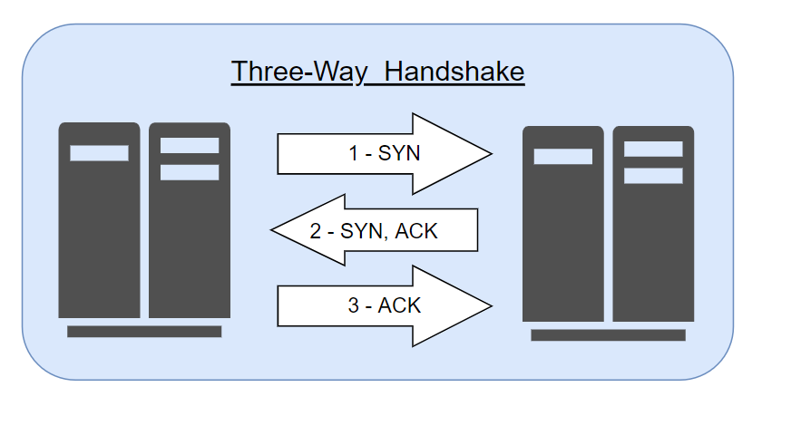
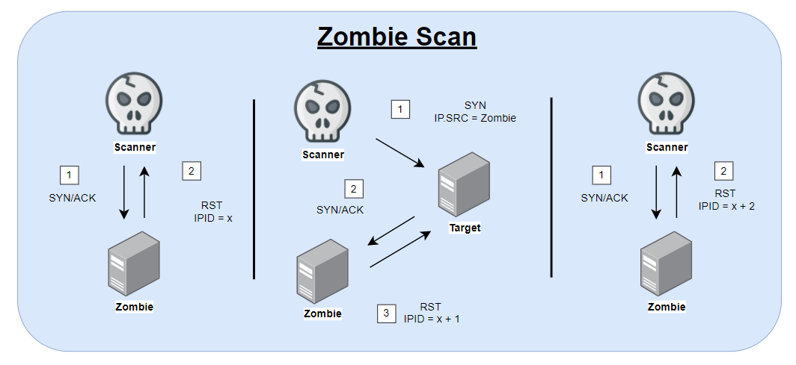
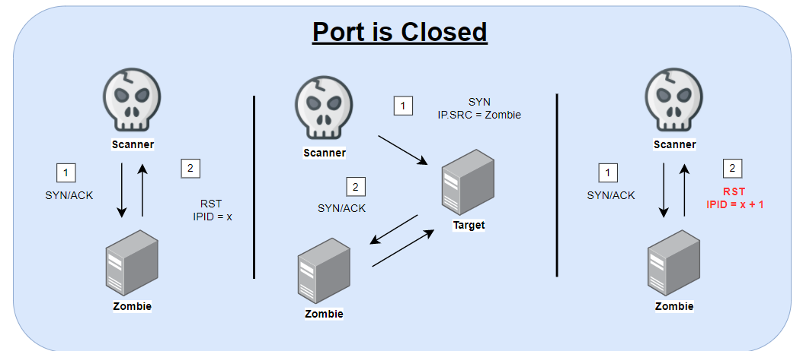

# Port Scanning

[Back to the Kali Cookbook](..\kali-network-cookbook.md)

## Introduction to Port Scanning

Open ports on a target system is an important step to defining the attack surface of a target. Open ports correspond to the networked services that are running on a system.

These open ports correspond to services that may be addressed with either UDP or TCP traffic. __Both TCP and UDP are transport protocols__. __Transmission Control Protocol (TCP)__ is the more commonly used of the two and provides _connection-oriented_ communication. __User Datagram Protocol (UDP)__ is a _non connection-oriented_ protocol that is sometimes used with services for which speed of transmission is more important than data integrity.

The penetration testing technique used to enumerate these services is called __port scanning__.

## UDP port scanning

UDP scanning can often be challenging, tedious, and time consuming. The first three recipes in this chapter will cover how to perform a UDP port scan with different tools in Kali Linux. To understand how these tools work, it is important to understand the two different approaches to UDP scanning that will be used.

One technique, which is addressed in the first recipe, is to rely exclusively on ICMP port-unreachable responses.

This type of scanning relies on the assumption that any UDP ports that are not associated with a live service will return an _ICMP port-unreachable_ response, and a lack of this response is interpreted as an indication of a live service.

While this approach can be effective in some circumstances, it can also return inaccurate results in cases where the host is not generating port-unreachable responses or the port-unreachable replies are rate limited or are filtered by a firewall.

The alternative approached, addressed in second and third recipes we review, is to use a service-specific probe to attemp to solicit a response, which would indicate that the expected service is running on the targeted port.

## TCP port scanning

TCP port scanning is much more common. These techniques includeL stealth scannig, connect scanning, and zombie scanning. Before diving into these techniques, it's important to understand how TCP connections are established and maintained. TCP is connection-oriented and data is only transferered after a connection has been established between two systems. This process associated with establishing with TCP connections is called the __three-way handshake__.

You can learn more about TCP/IP and TCP connections by referring to the networking section of my repositories. 

__Connect__ scanning and __stealth__ scanning are simple:

### Connect Scanning

__Connect__ scanning is used to establish a full TCP connection for each port that is scanned. This is to say that for each port that is scanned, the full three-way handshake is completed. If the connection is successfully established, the port is then determined to be open.

### Stealth Scanning

__Stealth__ scanning is also referred to as _SYN_ scanning or half-open scanning. For each port that is scanned, a single __SYN__ packet is sent to the destination port, and all ports that reply with a __SYN+ACK__ packet are assumed to be running live services.

Since no final __ACK__ is sent from the initiating system, the connection is left half open. This is referred to as stealth scanning because logging solutions that only record established connections will not record any evidence of the scan.

### Zombie Scanning

Zombie scanning is too map open ports on a remote system without producing any evidence that you have interacted with that system. The principles behind zombie scanning are somewhat complex:

* Identify a remote system for your zombie. This system requires the following characteristics:
    -[ ] It is idle and does not communicate actively with other systems on the network
    - [ ] It uses an incremental IPID sequence
* Send a SYN+ACK packet to this zombie host and record the initial IPID value.
* Send a SYN packed with the spoofed source IP address of the zombie system to the scan target system.
* Depending on the status of the port on the scan target, one of the following two things will happen:
    - [ ] If the port is open, the scan target will return a SYN+ACK packet to the zombie host, which it believes sent the original SYN request. In this case, the zombie host will respond to this unsolicited SYN+ACK packet with an RST packet and thereby increment its IPID value by one.
    - [ ] If the port is closed, the scan target will return an RST response to the zombie host, which it believes sent the original SYN request. This RST packet will solicit no response from the zombie, and the IPID will not be incremented. 
*  Send another SYN+ACK packet to the zombie host, and evaluate the final IPID value of the returned RST response. If this value has incremented by one, then the port on the scan target is closed, and if the value has incremented by two, then the port on the scan target is open.

### Zombie Scan Diagram

To perform a zombie scan, and initial __SYN/ACK__ request should be sent to the zombie system to determine the current __IPID__ value in the returned __RST__ packet. Then, a spoofed __SYN__ packet is sent to the scan target with a source IP address of the zombie system. If the port is open, the scan target will send a __SYN/ACK__ response back to the zombie. Since the zombie did not actually send the intial __SYN__ request, it will interpret the __SYN/ACK__ as unsolicited and send an __RST__ packet back to the target, thereby incrementing its __IPID__ by one.  Finally, another __SYN/ACK__ packet should be sent to the zombie, which will return an __RST__ packet and increment the __IPID__ one more time. An __IPID__ that has incremented by two from the initial response is indicative of the fact that all of these events have transpired and that the destination port on the scanned syste mis open. Alternatively, if the port on the scan target is closed, a different series of events will transpire, which will only cause the final __RST__ response __IPID__ value to increment by one.

If the destination port on the scan target is closed, an __RST__ packet will be sent to the zombie system in response to the initially spoofed __SYN__ packet. Since the __RST__ packet solicits no response, the __IPID__ value of the zombie system will not be incremented. As a result, the final __RST__ packet returned to the scanning system in repsonse to the __SYN/ACK__ packet will have the __IPID__ incremented by only one. This process can be performed for each port that is to be scanned, and it can be used to map open ports on a remote syste without leaving any evidence that a scan was performed by the scanning system.

## Port Scanning with Scapy (UDP, stealth, connect, zombie)

Scapy is a Python based tool that can be used to craft and inject custom packetes into a network. In this section, we'll use Scapy to scan for UDP services. 

This will be done by sending an empty UDP packet to destination prots and then identifying the ports that do not respond with an ICMP port-unreachable response.

We will also use Scapy to perform a TCP stealth scan. TCP port stealth scan performs a partial, three-way TCP handshake on target ports to identify whether the ports are accepting connections or not (sometimes referred to as half-open scan).

Finally, we will use Scapy to perform zombie scnas. It is possible to identify the open ports on a target system without ever giving that system any indication that you interacted with it, this method is extremely stealthy, but can be cumbersome to complete.

The simplest way to complete these exercises is by having an available target system, in this case, we'll use [Metasploitable3](https://github.com/rapid7/metasploitable3).

---

[Samples and Examples of Portscanning with several methodologies](./portscan2.html)

[Back to the main repo: Routepoison](../../../index.html)
