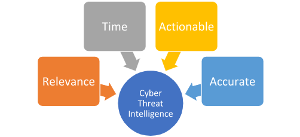
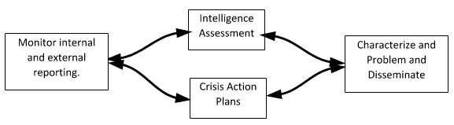
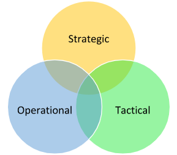

# Threat Intelligence Fundamentals

## Cyber Threat Intelligence Definition

**Cyber Threat Intelligence**(CTI) represents a vital asset in our arsenal, providing essential insights to fortify our defenses against cyberattacks. The primary objective of our CTI team is to transition our defense strategies from merely reactive measures to a more proactive, anticipatory stance. They contribute crucial insights to our Security Operations Center (SOC).

Four fundamental principles make CTI an integral part of our cybersecurity strategy:

**Relevance**: The cyber world is awash with diverse sources of information, from social media posts and security vendor reports to shared insights from similar organizations. However, the true value of this information lies in its relevance to our organization. For instance, if there is a reported vulnerability in a software that we, or our trusted partner organizations, do not use, the urgency to implement defensive measures is naturally diminished.

**Timeliness**: Swift communication of intelligence to our defense team is crucial for the implementation of effective mitigation measures. The value of information depreciates over time - freshly discovered data is more valuable, and 'aged' indicators lose their relevance as they might no longer be used by the adversary or may have been resolved by the affected organization.

**Actionability**: Data under analysis by a CTI analyst should yield actionable insights for our defense team. If the intelligence doesn't offer clear directives for action, its value diminishes. Intelligence must be scrutinized until it yields relevant, timely, and actionable insights for our network defense. Unactionable intelligence can lead to a self-perpetuating cycle of non-productive analysis, often referred to as a "self-licking ice cream cone".

**Accuracy**: Before disseminating any intelligence, it must be verified for accuracy. Incorrect indicators, misattributions, or flawed Tactics, Techniques, and Procedures (TTPs) can result in wastage of valuable time and resources. If the accuracy of any information is uncertain, it should be labeled with a confidence indicator, ensuring that our defense team is aware of potential inaccuracies.

When these four factors synergize, the intelligence gleaned allows us to:

* Gain insights into potential adversary operations and campaigns that might be targeting our organization.
* Enrich our data pool through analysis by CTI analysts and other network defenders.
* Uncover adversary TTPs, enabling the development of effective mitigation measures and enhancing our understanding of adversary behavior.
* Provide decision-makers within our organization with pertinent information for informed, impactful decision-making related to business operations.

## The Difference Between Threat Intelligence & Threat Hunting

Threat Intelligence and Threat Hunting represent two distinct, yet intrinsically interconnected, specialties within the realm of cybersecurity. While they serve separate functions, they both contribute significantly to the development of a comprehensive security analyst. However, it's important to note that they are not substitutes for each other.

**Threat Intelligence (Predictive)**: The primary aim here is to anticipate the adversary's moves, ascertain their targets, and discern their methods of information acquisition. The adversary has a specific objective, and as a team involved in Threat Intelligence, our mission is to predict:

* The location of the intended attack
* The timing of the attack
* The operational strategies the adversary will employ
* The ultimate objectives of the adversary

**Threat Hunting (Reactive and Proactive)**: Yes, the two terms are opposites, but they encapsulate the essence of Threat Hunting. An initiating event or incident, whether it occurs within our network or in a network of a similar industry, prompts our team to launch an operation to ascertain whether an adversary is present in the network, or if one was present and evaded detection.

Ultimately, Threat Intelligence and Threat Hunting bolster each other, strengthening our organization's overall network defense posture. As our Threat Intelligence team analyzes adversary activities and develops comprehensive adversary profiles, this information can be shared with our Threat Hunting analysts to inform their operations. Conversely, the findings from Threat Hunting operations can equip our Threat Intelligence analysts with additional data to refine their intelligence and enhance the accuracy of their predictions.

Criteria Of Cyber Threat Intelligence
What truly makes Cyber Threat Intelligence (CTI) valuable? What issues does it resolve? As discussed earlier, for CTI to be effective, it must be Actionable, Timely, Relevant, and Accurate. These four elements form the foundation of robust CTI that ultimately provides visibility into adversary operations. Additionally, well-constructed CTI brings forth secondary benefits, such as:

Understanding of threats to our organization and partner entities
Potential insights into our organization's network
Enhanced awareness of potential problems that may have gone unnoticed
Furthermore, from a leadership standpoint, high-quality CTI aids in fulfilling the business objective of minimizing risk as much as possible. As intelligence about an adversary targeting our business is gathered and analyzed, it empowers leadership to adequately assess the risk, formulate a contingency action plan if an incident occurs, and ultimately frame the problem and disseminate the information in a coherent and meaningful way.

As this information is compiled, it transforms into intelligence. This intelligence can then be classified into three different categories, each having varying degrees of relevance for different teams within our organization. These categories are:

* Strategic Intelligence
* Operational Intelligence
* Tactical Intelligence

In the diagram below, the ideal intersection is right at the core. At this convergence juncture, the Cyber Threat Intelligence (CTI) analyst is equipped to offer the most comprehensive and detailed portrait of the adversary and their modus operandi.

### Strategic Intelligence is characterized by:

* Being consumed by C-suite executives, VPs, and other company leaders
* Aiming to align intelligence directly with company risks to inform decisions
* Providing an overview of the adversary's operations over time
* Mapping TTPs and Modus Operandi (MO) of the adversary
* Striving to answer the Who? and Why?
* **Example**: A report containing strategic intelligence might outline the threat posed by APT28 (also known as Fancy Bear), a nation-state actor linked to the Russian government. This report could cover the group's past campaigns, its motivations (such as political espionage), targets (like governments, military, and security organizations), and long-term strategies. The report might also explore how the group adapts its tactics and tools over time, based on historical data and the geopolitical context.

### Operational Intelligence is characterized by:

* Also including TTPs of an adversary (similar to strategic intelligence)
* Providing information on adversary campaigns
* Offering more detail than what's found in strategic intelligence reports
Being produced for mid-level management personnel
* Working towards answering the How? and Where?
* **Example**: A report containing operational intelligence can provide detailed analysis of a ransomware campaign conducted by the REvil group. It would include how the group gains initial access (like through phishing or exploiting vulnerabilities), its lateral movement tactics (such as credential dumping and exploiting Windows admin tools), and its methods of executing the ransomware payload (maybe after hours to maximize damage and encrypt as many systems as possible).

### Tactical Intelligence is characterized by:

* Delivering immediate actionable information
* Being provided to network defenders for swift action
* Including technical details on attacks that have occurred or could occur in the near future
* Example: A report containing tactical intelligence could include specific IP addresses, URLs, or domains linked to the REvil command and control servers, hashes of known REvil ransomware samples, specific file paths, registry keys, or mutexes associated with REvil, or even distinctive strings within the ransomware code. This type of information can be directly used by security technologies and incident responders to detect, prevent, and respond to specific threats.
It's crucial to understand that there's a degree of overlap among these three types of intelligence. That's why we represent the intelligence in a Venn diagram. Tactical intelligence contributes to forming an operational picture and a strategic overview. The converse is also true.

## How To Go Through A Tactical Threat Intelligence Report

Interpreting threat intelligence reports loaded with tactical intelligence and Indicators of Compromise (IOCs) is a task that requires a structured methodology to optimize our responsiveness as SOC analysts or threat hunters. Let's delve into a procedural, in-depth process using a theoretical scenario involving a threat intelligence report on an elaborate Emotet malware campaign:

**Comprehending the Report's Scope and Narrative**: The initial phase of interpreting the report involves comprehending its broader context. Suppose our report elucidates an ongoing Emotet campaign directed towards businesses in our sector. The report may offer macro-level insights about the attackers' objectives and the types of entities in their crosshairs. By grasping the narrative, we can assess the pertinence of the threat to our own business.

**Spotting and Classifying the IOCs**: Tactical intelligence typically encompasses a list of IOCs tied to the threat. In the context of our Emotet scenario, these might include IP addresses linked to command-and-control (C2) servers, file hashes of the Emotet payloads, email addresses or subject lines leveraged in phishing campaigns, URLs of deceptive websites, or distinct Registry alterations by the malware. We should partition these IOCs into categories for more comprehensible understanding and actionable results: Network-based IOCs (IPs, domains), Host-based IOCs (file hashes, registry keys), and Email-based IOCs (email addresses, subject lines). Furthermore, IOCs could also contain Mutex names generated by the malware, SSL certificate hashes, specific API calls enacted by the malware, or even patterns in network traffic (such as specific User-Agents, HTTP headers, or DNS request patterns). Moreover, IOCs can be augmented with supplementary data. For instance, IP addresses can be supplemented with geolocation data, WHOIS information, or associated domains.

Comprehending the Attack's Lifecycle: The report will likely depict the Tactics, Techniques, and Procedures (TTPs) deployed by the attackers, correspondingly mapped to the MITRE ATT&CK framework. For the Emotet campaign, it might commence with a spear-phishing email (Initial Access), proceed to execute the payload (Execution), establish persistence (Persistence), execute defense evasion tactics (Defense Evasion), and ultimately exfiltrate data or deploy secondary payloads (Command and Control). Comprehending this lifecycle aids us in forecasting the attacker's moves and formulating an effective response.

**Analysis and Validation of IOCs**: Not all IOCs hold the same utility or accuracy. We need to authenticate them, typically by cross-referencing with additional threat intelligence sources or databases such as VirusTotal or AlienVault's OTX. We also need to contemplate the age of IOCs. Older ones may not be as pertinent if the attacker has modified their infrastructure or tactics. Moreover, contextualizing IOCs is critical for their correct interpretation. For example, an IP address employed as a C2 server may also host legitimate websites due to IP sharing in cloud environments. Analysts should also consider the source's reliability and whether the IOC has been whitelisted in the past. Ultimately, understanding the false positive rate is crucial to avoid alert fatigue.

**Incorporating the IOCs into our Security Infrastructure**: Once authenticated, we can integrate these IOCs into our security solutions. This might involve updating firewall rules with malicious IP addresses or domains, incorporating file hashes into our endpoint detection and response (EDR) solution, or creating new IDS/IPS signatures. For email-based IOCs, we can update our email security gateway or anti-spam solution. When implementing IOCs, we should consider the potential impact on business operations. For example, blocking an IP address might affect a business-critical service. In such cases, alerting rather than blocking might be more appropriate. Additionally, all changes should be documented and approved following change management procedures to maintain system integrity and avoid unintentional disruptions.

**Proactive Threat Hunting**: Equipped with insights from the report, we can proactively hunt for signs of the Emotet threat in our environment. This might involve searching logs for network connections to the C2 servers, scanning endpoints for the identified file hashes, or checking email logs for the phishing email indicators. Threat hunting shouldn't be limited to searching for IOCs. We should also look for broader signs of TTPs described in the report. For instance, Emotet often employs PowerShell for execution and evasion. Therefore, we might hunt for suspicious PowerShell activity, even if it doesn't directly match an IOC. This approach aids in detecting variants of the threat not covered by the specific IOCs in the report.

**Continuous Monitoring and Learning**: After implementing the IOCs, we must continually monitor our environment for any hits. Any detection should trigger a predefined incident response process. Furthermore, we should utilize the information gleaned from the report to enhance our security posture. This could involve user education around the phishing tactics employed by the Emotet group or improving our detection rules to catch the specific evasion techniques employed by this malware. While we should unquestionably learn from each report, we should also contribute back to the threat intelligence community. If we discover new IOCs or TTPs, these should be shared with threat intelligence platforms and ISACs/ISAOs (Information Sharing and Analysis Centers/Organizations) to aid other organizations in defending against the threat.

This meticulous, step-by-step process, while tailored to our Emotet example, can be applied to any threat intelligence report containing tactical intelligence and IOCs. The secret is to be systematic, comprehensive, and proactive in our approach to maximize the value we derive from these reports.

---

↩️: [Home](../../index.md)
