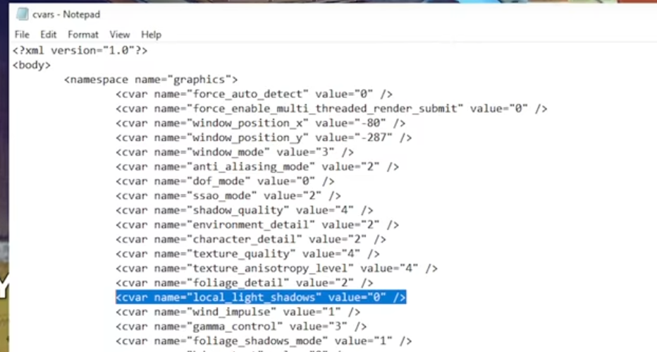

# Destiny 2 Settings

Update these settings for a better experience:

* Motion Blur - OFF
	+ Foreground blur
* Aim Smoothing - OFF
* Controller Vibration - OFF
* Vsync - OFF 
	+ Screen Tearing
* Film Grain - OFF
	+ Old Movie Issue
* Chromatic Abberation - OFF
	+ Not so noticeable 
	+ Old Movie Issue
* ADS Sensitivity
	+ >1.0 makes aim-down-sight difficult
	+ recommend 0.5 - 1
* Depth of Field - OFF
	+ Similar to Motion Blur
* Autolook Centering - OFF
	+ Controller Only
* Wind Impulse - OFF
	+ Makes grass and foliage 'react'
* Enhanced Pointer Precision - OFF
	+ Windows Setting

## Turn of Shadows	

+ Turn off shadows - PC Only
	+ C:\Users\[USERNAME]\AppData\Roaming\Bungie\ DestinyPC\prefs
	+ file 'cvars'
	+ local_light_shadows
		- value=0
		

---

↩️: [Home](../index.md)
