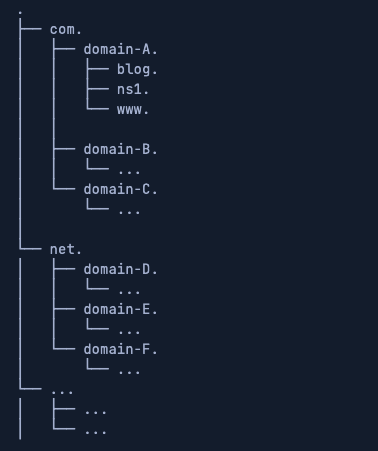
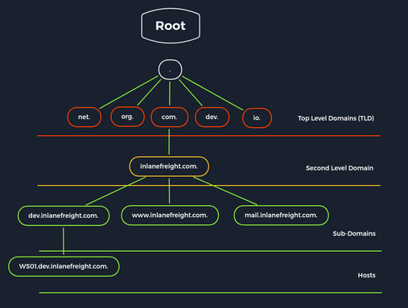
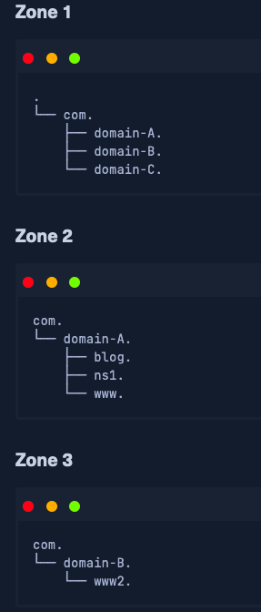

# DNS Enumeration using Python

The components of a DNS services consist of:

* name servers
* zones
* domain names
* IP Address

The name servers contain so-called **zones** or **zone files**.

## Domain Structure

Take the following fully qualified domain name (FQDN):

* www.domain-A.com

Here's an example of DNS tree like structure:



And here's another example:



Each domain consists of at least two parts:

1. Top-Level domain (TLD)
2. Domain Name

Three subdomains can represent a single host or virtual host. The DNS servers are divided into four different types:

* recursive resolvers (DNS recursor)
* root name server
* TLD name server
* authoritative name servers

## Recursive DNS Resolver

The recursive resolver acts as an agent between the client and the name server. After the recursive resolver receives a DNS query from a web client, it responds to this query with cached data, or it sends a query to a root name server, followed by a query to a TLD name server and finally a query to an authoritative name server. Once it has received a responde from the authoritative name server with the requested IP address, the recursive resolver sents the client's response.

## Root Name Server

Thirteen root name servers can be reached under IPv4 and IPv6 addresses. An international non-profit organization maintains these root name servers called the Internet Corporation for Assigned Names and Numbers (ICANN).

The zone files of these contain all domain names and IP addresses of the TLDs. Every recursive resolver knows these 13 root name servers.

These are the first stations in the search for DNS entries for each recursive resolver.

We find 13 root name servers on the domain *root-servers.net* with the corresponding letter as a subdomain.:

> dig ns root-servers.net | grep NS | sort -u

``` bash
➜  ~ dig ns root-servers.net | grep NS | sort -u
; EDNS: version: 0, flags:; udp: 512
;; ANSWER SECTION:
;; flags: qr rd ra; QUERY: 1, ANSWER: 13, AUTHORITY: 0, ADDITIONAL: 21
;root-servers.net.		IN	NS
root-servers.net.	604800	IN	NS	a.root-servers.net.
root-servers.net.	604800	IN	NS	b.root-servers.net.
root-servers.net.	604800	IN	NS	c.root-servers.net.
root-servers.net.	604800	IN	NS	d.root-servers.net.
root-servers.net.	604800	IN	NS	e.root-servers.net.
root-servers.net.	604800	IN	NS	f.root-servers.net.
root-servers.net.	604800	IN	NS	g.root-servers.net.
root-servers.net.	604800	IN	NS	h.root-servers.net.
root-servers.net.	604800	IN	NS	i.root-servers.net.
root-servers.net.	604800	IN	NS	j.root-servers.net.
root-servers.net.	604800	IN	NS	k.root-servers.net.
root-servers.net.	604800	IN	NS	l.root-servers.net.
root-servers.net.	604800	IN	NS	m.root-servers.net.
```

These 13 root name servers represent the 13 different types of root name servers. It does not mean that it only spread over 13 hosts, but over 600 copies of these root name servers worldwide.

## TLD Name Server

A TLD name server manages the information on all domain names that have the same TLD. These TLD name servers are the responsibility of the Internet Assigned Numbers Authority (IANA) and are managed by it.

## Authoritative Name Server

Authoritative name servers store DNS record information for domains. These servers are responsible for providing ansers to requests from name servers with the IP addresss and other DNS entries for a web page so the web page can be addresssed and accessed by the client. When a recursive resolver receives a TLD name server response, the response referes to an authoritative name server. The authoritative name server is the last stpe to get and IP address.

---

## Primary DNS Server

The primary DNS server is the server of the zone file, which contains all authoritative information for a domain and is responsible for adminitering this zone. The DNS records of a zone can only be edited on the primary DNS server, which then updates the secondary DNS servers.

## Secondary DNS Server

Secondary DNS servers conatin read-only copies of the zone files from the primary DNS server. These servers compare their data with the primary DNS server at regular interval and thus server as a backup server. It is useful because a primary name server's failure means that connections without name resolution are no longer possible. To establish connections anyway, the user owuld have to know the IP addresses of the contacted servers. Nevertheless, this is not the rule

## Zone Files

We already know that the zone files contain the corresponding records and information for the specific domain, we distinguish:

* primary zone (master zone)
* secondary zone (slave zone)

The secondary zone on the secondary DNS server serves as a substitute for the primary zone on the primary DNS server if the primary DNS server should be unreachable. The creation and transfer of the **primary zone** copy from the primary DNS server to the secondary DNS server is called a "**zone tranfer**".

Zone examples:



## Zone Transfer

There are two differnt types of zone transfers:

* AXFR - Asynchoronous Full Transfer Zone
* IXFR - Incremental Zone Transfer

An AXFR is a complete transfer of all entires of the zone file. In contrast, IXFR transfers only the new DNS and zone files to secondary DNS servers.

The problem with DNS servers and zone transfers is that it does no require authentication and can be requested by any client. If the admin has not set "Trusted Hosts/IP addresses" for the DNS servers, which have permission to receive these zones, we can also query the entire zone files with its contents. This will give us all IP addresses with the respective hosts and significantly increate our attack vector if the agreement does not limit our scope. Even today, it is quite common that the DNS servers are misconfigured and allow this.

---

| Record | 	Description |
|:-:|:-:|
| A |	IP Version 4 Address records |
| AAAA | 	IP Version 6 Address records |
| CNAME  |	Canonical Name records |
| HINFO  |	Host Information records |
| ISDN | 	Integrated Services Digital Network records |
| MX | 	Mail exchanger record |
| NS | 	Name Server records |
| PTR | 	Reverse-lookup Pointer records |
| SOA | 	Start of Authority records |
| TXT | 	Text records |

We can use many tools, including:

* dig
* nslookup

## DIG

### NS Query

> dig NS inlanfreight.com

### SOA Queries

> dig SOA inlanfreight.com

### NSLOOKUP - SPF

> nslookup -type=SPF inlanefreight.com

### NSLOOKUP -DMARC

> nslookup -type=txt _dmarc.inlanefreight.com

---


## DNS Security

Many companies have already recognized DNS's vulnerability and try to close this gap with dedicated DNS servers, regular scans, and vulnerability assessment software. However, beyond that fact, more and more companies recognize the value of the DNS as an active line of defense, embedded in an in-depth and comprehensive security concept.

This makes sense because the DNS is part of every network connection. The DNS is uniquely positioned in the network to act as a central control point to decide whether a benign or malicious request is received.

DNS Threat Intelligence can be integrated with other open-source and other threat intelligence feeds. Analytics systems such as EDR (Endpoint Detection and Response) and SIEM (Security Information and Event Management) can provide a holistic and situation-based picture of the security situation. DNS Security Services support the coordination of incident response by sharing IOCs (Indicators of Compromise) and IOAs (Indicators of Attacks) with other security technologies such as firewalls, network proxies, endpoint security, Network Access Control (NACs), and vulnerability scanners, providing them with information.
DNSSEC

Another feed used for the security of DNS servers is Domain Name System Security Extensions (DNSSEC), designed to ensure the authenticity and integrity of data transmitted through the Domain Name System by securing resource records with digital certificates. DNSSEC ensures that the DNS data has not been manipulated and does not originate from any other source. Private keys are used to sign the Resource Records digitally. Resource Records can be signed several times with different private keys, for example, to replace keys that expire in time.
Private Key

The DNS server that manages a zone to be secured signs its sent resource records using its only known private key. Each zone has its zone keys, each consisting of a private and a public key. DNSSEC specifies a new resource record type with the RRSIG. It contains the signature of the respective DNS record, and these used keys have a specific validity period and are provided with a start and end date.
Public Key

The public key can be used to verify the signature of the recipients of the data. For the DNSSEC security mechanisms, it must be supported by the provider of the DNS information and the requesting client system. The requesting clients verify the signatures using the generally known public key of the DNS zone. If a check is successful, manipulating the response is impossible, and the information comes from the requested source.


---

↩️: [Home](../../index.md)
