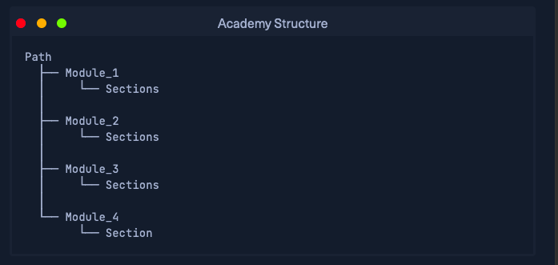
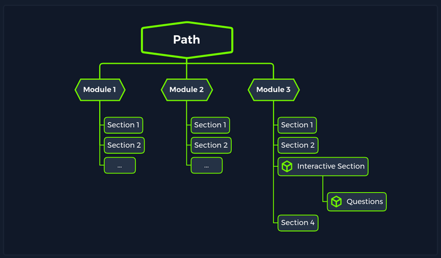

# Hack the Box Academy Fundamentals

## Academy Structure

A __module__ is split into __Sections__ and a __Path__ contains many modules.

## Paths

__Paths__ are collections of modules (i.e. a path named __Basic Toolset__ may include modules on _nmap_, _sqlmap_, _hashmap_)

## Modules 

__Modules__ always focus on specific topics or tools to help students enhance their skillset in a particular area. Many modules are scenario-based and make an effort to follow steps that would be taken in a real-world assessment to make the material useful and relevant.

## Cheat Sheet 1

| Command | Description |
|:-:|:-:|
| uname -a | shows current kernel and OS info |
| sudo | executes command as admin|

There is an excercise to connect to a 'VM' via their local web application. Then the following Section has another VM spawned for the user to HTTP to on a specific port. And then provide the output from their spawned VM's website.

Here is another image of their structure:

---

↩️: [Home](../../index.md)
