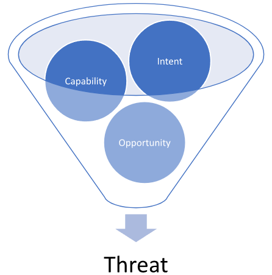
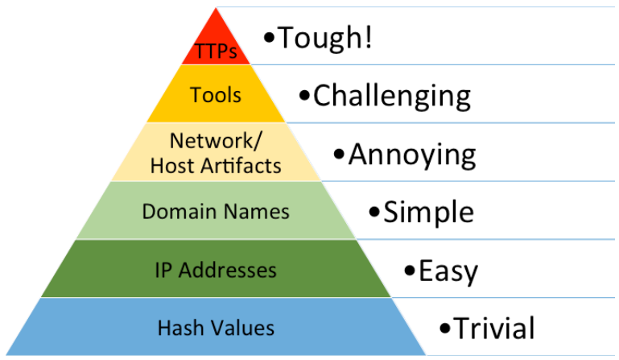
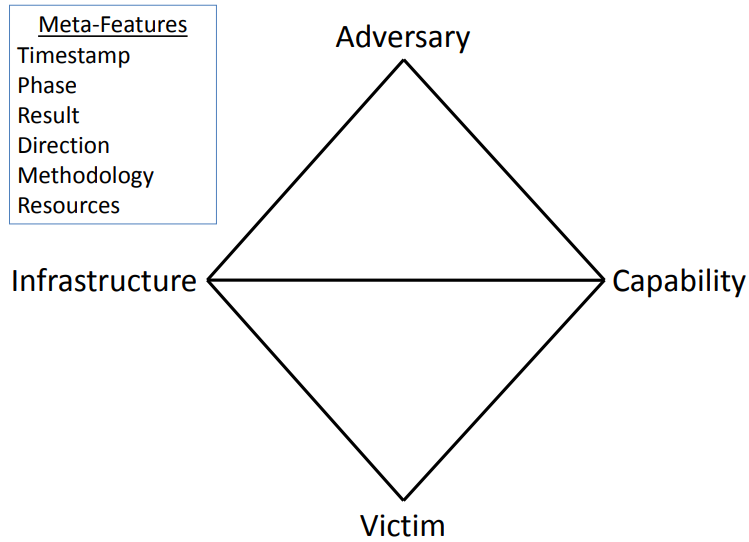

## Hunting Glossary

Within the domain of cybersecurity and threat hunting, several crucial terms and concepts play a pivotal role. Here's an enriched understanding of these:

**Adversary**: An adversary, within the realm of Cyber Threat Intelligence (CTI), refers to an entity driven by shared objectives as your organization, albeit unauthorized, seeking to infiltrate your business and satisfy their collection requirements, which may include financial gains, insider information, or valuable intellectual property. These adversaries possess varying levels of technical expertise and are motivated to circumvent your security measures.

Adversaries can be classified into distinct categories, including cyber criminals, insider threats, hacktivists, or state-sponsored operators. Each category exhibits unique characteristics and motivations in their pursuit of unauthorized access and exploitation.

**Advanced Persistent Threat (APT)**: APTs are typically associated with highly organized groups or nation-state entities that possess extensive resources, thereby enabling them to carry out their malicious activities over prolonged periods. While APTs target various sectors, they show a marked preference for high-value targets, which can include governmental organizations, healthcare infrastructures, and defense systems.

Contrary to what the name might suggest, being labeled as an APT doesn't necessarily imply that the group utilizes technologically advanced techniques. Rather, the 'Advanced' aspect can refer to the sophisticated strategic planning, and 'Persistent' alludes to their dogged persistence in achieving their objectives, backed by substantial resources including, but not limited to, financial backing, manpower, and time.

* **Tactics, Techniques, and Procedures (TTPs)**: A term borrowed from the military, TTPs symbolize the distinct operational patterns or 'signature' of an adversary.

    - Tactics: This term describes the strategic objectives and high-level concepts of operations employed by the adversary. Essentially, it addresses the 'why' behind their actions.
    - Techniques: These are the specific methods utilized by an adversary to accomplish their tactical objectives, providing the 'how' behind their actions. Techniques don't provide step-by-step instructions but rather describe the general approach to achieving a goal.
    - Procedures: These are the granular, step-by-step instructions, essentially the 'recipe' for the implementation of each technique.

Analyzing TTPs offers deep insights into how an adversary penetrates a network, moves laterally within it, and achieves their objectives. Understanding TTPs allows for the creation of Indicators of Compromise (IOCs), which can help detect and thwart future attacks.

**Indicator**: An indicator, when analyzed in CTI, encompasses both technical data and contextual information. Isolated technical data lacking relevant context holds limited or negligible value for network defenders. Contextual details allow for a comprehensive understanding of the indicator's significance, enabling effective threat analysis and response.

* **Threat**: A threat is a multifaceted concept, consisting of three fundamental factors, intent, capability, and opportunity.

Firstly, **intent** signifies the underlying rationale driving adversaries to target and exploit your network infrastructure. This intent can range from corporate espionage to financial gains through cybercrime, or even targeting your business relationships with other entities.

Secondly, **capability** denotes the tools, resources, and financial backing that adversaries possess to carry out their operations successfully. Their skill level in penetrating your network and the availability of sufficient financial resources determine their capability to sustain ongoing attacks against your organization.

Lastly, **opportunity** refers to conditions or events that provide favorable circumstances for adversaries to execute their operations. This encompasses instances where adversaries acquire relevant email addresses or credentials from your network, as well as their awareness of vulnerabilities in specific software systems.

**Campaign**: A campaign refers to a collection of incidents that share similar Tactics, Techniques, and Procedures (TTPs) and are believed to have comparable collection requirements. This type of intelligence necessitates substantial time and effort to aggregate and analyze, as businesses and organizations progressively report and uncover related malicious activities.

**Indicators of Compromise (IOCs)**: IOCs are digital traces or artifacts derived from active or past intrusions. They serve as 'signposts' of a specific adversary or malicious activity. IOCs can include a wide array of elements such as the hashes of malicious files, suspicious IP addresses, URLs, domain names, and names of malicious executables or scripts. Continually tracking, cataloging, and analyzing IOCs can greatly enhance our threat detection capabilities, leading to faster and more effective responses to cyber threats.

**Pyramid of Pain**: Pyramid of Pain is a critical visualization which presents a hierarchy of indicators that can support us in detecting adversaries. It also showcases the degree of difficulty in acquiring these specific indicators and the subsequent impact of gathering intelligence on them. The Pyramid of Pain concept was brought to life by David Bianco from FireEye in his insightful presentation, I[ntel-Driven Detection and Response to Increase Your Adversary’s Cost of Operations](https://rvasec.com/slides/2014/Bianco_Pyramid%20of%20Pain.pdf). 

As we ascend the Pyramid of Pain, obtaining adversary-specific Indicators of Compromise (IOCs) becomes increasingly challenging. However, the flip side is that acquiring these specific IOCs forces the adversary to alter their attack methodologies, a task that is far from simple for them.

**Hash Values**: Hash values are the digital fingerprints of files. They are created using algorithms like MD5, SHA-1, or SHA-256 that take an input (or 'message') and return a fixed-size string of bytes. For instance, malware binaries can be identified through their unique hash values. However, a slight change to the file, such as adding a byte or changing a single character, will dramatically alter the hash value, making it an easy-to-change and, therefore, less reliable indicator.

**IP Addresses**: IP addresses are unique identifiers for devices on a network. They can be used to track the source of network traffic or a potential attack. However, adversaries often use tactics such as IP spoofing, VPNs, proxies, or TOR networks to hide their true IP addresses, making this level of indicator easy to change and somewhat unreliable.

**Domain Names**: Domains are used to identify one or more IP addresses. For example, the domain name www.example.com represents about a dozen IP addresses. Malicious actors often use domain generation algorithms (DGAs) to produce a large number of pseudo-random domain names to evade detection. They can also use dynamic DNS services to quickly change the IP addresses associated with a domain.

## Network/Host Artifacts

**Network Artifacts**: These are residual traces of an attacker's activities within the network infrastructure. They can be found in network logs, packet captures, netflow data, or DNS request logs, to name a few. Examples might include certain patterns in network traffic, unique packet headers, or unusual protocol usage. Network artifacts are challenging for an attacker to modify without impacting the effectiveness or stealth of their operation.

**Host Artifacts**: On the other hand, host artifacts refer to remnants of malicious activity left on individual systems or endpoints. These could be found within system logs, file systems, registry keys, list of running processes, loaded DLLs, or even in volatile memory. For instance, unusual entries in the Windows Registry, unique file paths, or suspicious running processes could all be considered host artifacts. These indicators are also fairly hard for an adversary to alter without affecting their intrusion campaign or revealing their presence.

Analyzing these artifacts can provide valuable insights into an adversary's tools, techniques, and procedures (TTPs), and help in the detection and prevention of future attacks. However, the higher position of Network and Host Artifacts in the Pyramid of Pain indicates that they are harder to utilize for detection, and also harder for the attacker to change or obfuscate.

**Tools**: Tools refer to the software used by adversaries to conduct their attacks. This could include malware, exploits, scripts, or command and control (C2) frameworks. Identifying the tools used by an adversary can provide valuable insight into their capabilities and intentions. However, sophisticated adversaries often use custom tools or modify existing ones to evade detection.

TTPs (Tactics, Techniques, and Procedures): This is the pinnacle of the Pyramid of Pain. TTPs refer to the specific methods used by adversaries to conduct their attacks. Tactics describe the adversary's overall objectives, techniques describe the actions taken to achieve those objectives, and procedures are the exact steps taken to execute the techniques. Identifying an adversary's TTPs can provide the most valuable insight into their operations and are the most difficult for an adversary to change without significant cost and effort. Examples might include the use of spear-phishing emails for initial access (tactic), exploitation of a specific software vulnerability (technique), and the specific steps taken to exploit that vulnerability (procedure).

**Diamond Model**: The Diamond Model of Intrusion Analysis is a conceptual framework designed to illustrate the fundamental aspects of a cyber intrusion. This model, developed by Sergio Caltagirone, Andrew Pendergast, and Christopher Betz, aims to provide a more structured approach to understand, analyze, and respond to cyber threats.

The model is structured around four key components, represented as vertices of a diamond:

**Adversary**: This represents the individual, group, or organization responsible for the cyber intrusion. It's important to understand their capabilities, motivations, and intent to effectively defend against their attacks.

**Capability**: This represents the tools, techniques, and procedures (TTPs) that the adversary uses to carry out the intrusion. This could include malware, exploits, and other malicious tools, as well as the specific methods used to deploy these tools.

**Infrastructure**: This represents the physical and virtual resources that the adversary uses to facilitate the intrusion. It can include servers, domain names, IP addresses, and other network resources used to deliver malware, control compromised systems, or exfiltrate data.

**Victim**: This represents the target of the intrusion, which could be an individual, organization, or system. Understanding the victim's vulnerabilities, the value of their assets, and their potential exposure to threats is crucial for effective defense.

These four components are connected by bidirectional arrows, representing the dynamic relationships and interactions between them. For example, an adversary uses capabilities through an infrastructure to target a victim. This model allows for the capture of complex relationships and the construction of robust strategies for threat detection, mitigation, and prediction.

Comparing this to the Cyber Kill Chain model, we can see that the Diamond Model provides a more detailed view of the cyber intrusion ecosystem. While the Cyber Kill Chain focuses more on the stages of an attack (from reconnaissance to actions on objectives), the Diamond Model provides a more holistic view of the components involved in the intrusion and their interrelationships.

Let's consider a technical example to illustrate the Diamond Model: Suppose a financial institution (Victim) is targeted by a cybercriminal group (Adversary). The group uses spear-phishing emails (Capability) sent from a botnet (Infrastructure) to deliver a banking Trojan. When a recipient clicks on a malicious link in the email, the Trojan is installed on their system, allowing the cybercriminals to steal sensitive financial data.

In this scenario, the Diamond Model helps to highlight the interplay between the different components of the intrusion. By analyzing these components and their interactions, the financial institution can gain a deeper understanding of the threat they're facing and develop more effective strategies for mitigating this and future threats. This could involve strengthening their email security protocols, monitoring for signs of the specific banking Trojan, or implementing measures to detect and respond to unusual network activity associated with the botnet.

Overall, the Diamond Model provides a complementary perspective to the Cyber Kill Chain, offering a different lens through which to understand and respond to cyber threats. Both models can be useful tools in the arsenal of a cybersecurity professional.

---

↩️: [Home](../../index.md)
