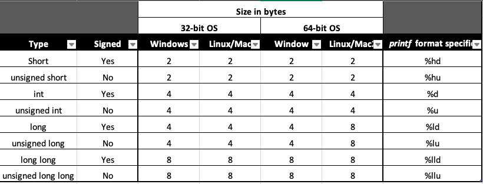

# Chapter 2: Types

> /Users/grs-dev/Documents/GitHub/routepoison.github.io/programming/cpp/cpp-crash-course

Hardin once said, "To succeed, planning alone is insufficient. One must improvise as well." I'll improvise. - Isaac Asimov, Foundation

## Lets Get Started: Types

A type declares how an object will be interpreted and used by the compiler. Every C++ Program has a type, and this chapter begins with a thorough disussion of fundamental types and then introduces user-defined types. While doing this, it will also cover several control flow structures.

## Fundamental Types

_Fundamental types_ are the most basic types of object and include the following:

* integer
* floating-point
* character
* boolean
* byte
* size_t
* void

Some refer to the fundamental types as _primitive_ or _built-int_ types because they're part of the core language and are almost always available to you. These types will work on any platform, but their features, such as size and memory layout depend on implementaion.

Fundamental types strike a balance. On one hand, they try to map a direct relationship from C++ construct to computer hardware; on the other hand, they simplify writing cross-platform code by allowing a programmer to write code once that works on many platforms.

## Integer Types

Integer types store a whole number that you can write without a fractional component. The four sizes of interget types are:

* _short int_
* _int_
* _long int_
* _long long int_

Each of these can be either sized or unsigned. A _signed_ variable can be:

* positive
* negative
* zero

An _unsigned_ variable must be:

* non-negative

Integer types are signed and _int_ by default, which means you can use the following shorthand notations in your programs: 

* short
* long
* long long

rather than:

* short int
* long int
* long long int

### Table: Integer Types, Sizes, and Format Specifiers

Table 2-1: Integer Types, Sizes, and Format Specifiers

