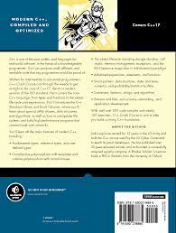

# C++ Crash Course

> /Users/grs-dev/Documents/GitHub/routepoison.github.io/programming/cpp/cpp-crash-course

##  Book Cover




## Table of Contents

* [Chapter 2: Types](./2_types.html)

## Quick References

```cpp
int main(){

}
```
