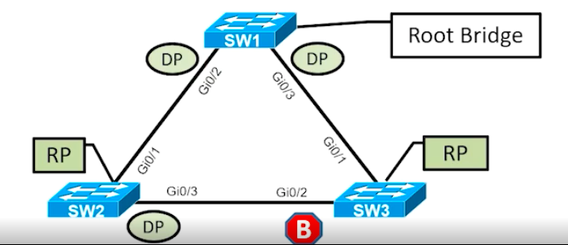

# 🔖 Lesson 3: Spanning Tree Protocol 🌲

↩️ [Back to Routepoison.com!](../../../index.md)

## 📃 3.1 Introduction to Spanning Tree Protocol (STP)

Spanning Tree Protocol (STP) is a Layer 2 protocol with multiple modes:

* 802.1D, which is the original specification
* Per-VLAN Spanning Tree (PVST)
* Per-VLAN Spanning Tree Plus (PVST+)
* 802.1W Rapid Spanning Tree Protocol (RSTP)
* 802.1S Multiple Spanning Tree Protocol (MST)

Catalyst Switches operate in PVST+, RSTP, and MST modes. All three of these modes are backward compatible with 802.1D.

__Bridge protocol data unit (BPDU)__: STP packets that are used by switches to identify a hierarchy and notify of changes in the STP topology

* A BPDU uses the destionation MAC address __01:80:c2:00:00:00__
* __Configuration BPDU__: Used to build the STP topology by identifying the root bridge, root ports, designated ports, and blocking ports. Contains the following fields:
    + STP type, root path cost, root bridge identifier, local bridge identifier, max age, hello time, and forward delay
* __Topology change notification (TCN) BPDU__: Used to communicate changes in the Layer 2 topology to other switches

### Key Terms

* __Root Bridge__: The root bridge is the top of the spanning tree for all path calculations by other switches. All ports art in a forwarding state.
* __Root Port (RP)__: The network port that connects directly to the root bridge or to a switch that conects to the root bridge.
* __Designated Port (DP)__: A network port that receives and forwards BPDU frames to other switches. A DP provides connectivity to downstream switches. All ports on the root bridge are categorized as designated ports. There should only be one DP on a link.
* __Blocking port__: A port that is not forwarding traffic because of STP calculations.



### Key Terms Contd.


* __System priority__: This is a 4-bit value that indicates the preference for a switch to be the root bridge. The default value is 32,768. Increments in valued of 4,096
* __System ID extension__: This 12-bit value identifies the VLAN that the BPDU correlates to. The system priority and system ID extension are combined.
* __Local bridge identifier__: This is a combination of the local switch's bridge system MAC address, system ID extension, and system priority of the local bridge.
* __Root bridge identifier__: This is a combination of the root bridge system MAC address, system ID extension, and system priority of the root bridge.

#### 802.1D Port States

* __Disabled__: The port is shut down
* __Blocking__: The ports only receives BPDUs, but does not modify MAC table or forward packets
* __Listening__: The port can now send or receive BPDUs. It cannot forward any other network traffic.
    - Stays in this state for the duration of STP forwarding time (15s)
* __Learning__: The port can now modify the MAC address table with any network traffic that it receives.
    - Stays in this state for the duration of the STP forwarding time (15s)
* __Forwarding__: The switch port can forward all network traffic and can update the MAC address table as expected
* __Broken__: The switch has detected a configuration problem.

## 📃 3.2 Building STP Topology

The STP Topology is calculated in the following fashion:

1. Elect the root bridge
2. Identify the Root Port (RP)
3. Locate designated ports (DP)
4. Identify which DP will change to a blocking state

### Root Bridge Election

* Upon initialization the switch thinks that it is the root bridge.
* Will receive configuration BPDUs from other switches and compare them against itself.
    + If the neighbor's BPDU is inferior, it ignores the BPDU.
    + If the neighbor's BPDU is preferred, it will advertise the neighbor's Bridge Identifier in the root bridge identifier of the BPDUs it will advertise
* The switch's system priority is compared first. Lower value is more preferred.
* If there is a tie, then the switch with lower system MAC address is preferred.
* Election process with a third switch.
* Election has already occurred between two switches. The root bridge MAC and priority is included in the BPDUs by all member switches.

### Root Port Selection

The downstream switches select their root port based on:

1. The interface associated to lowest root path cost is more preferred. The root path cost is the cost associated to the path taken to reach the root bridge.
2.The interface associated to the lowest system priority of the advertising switch is preferred next.
3. The interface associated to the lowest system MAC address of the advertising switch is preferred next.
4. When multiple links are associated to the same switch, the lowest port priority from the advertising switch is preferred.
5. When multiple link are associated to the same switch, the lower port number from the advertising switch is preferred.

### Locate Designated Ports

After the root bridge and RPs have been identified, all other ports are considered designated ports.

However, if two non-root switches are connected to each other on their designated ports, one of those switch ports must be set to a blocking state to prevent a forwarding loop

Blocking ports are identified based on the following logic:

1. The interface is a designated port and must not be considered a RP
2. The switch with the lower path cost to the root bridge forwards packets, and the one with the higher path cost blocks.
3. The system priority of the local switch is compared to the system priority of the remote switch. The local port is moved to a blocking state if the remote system priority is lower than that of the local switch.
4. The system MAC address of the local switch is compared to the system MAC of the remote switch. The local designated port is moved to a blocking state if the remote system MAC address is lower than that of the local switch.

## 📃 3.3 Per VLAN Spanning Tree (PVST) and PVST+

### Limitations of 802.1D

* Original 802.1D supported only one STP topology for the entire switch network. Also referre to as Common Spanning Tree (CST).
* Does not allow the manipulation of the Layer 2 topology for specific VLANs that deviate from the CST. Prevents optimal flow or load-balancing based on traffic patterns.

### Per VLAN Spanning-Tree

* Per-VLAN Spanning Tree (PVST)
* Per-VLAN Spanning Tree Plus (PVST+)

> __show spanning-tree__

You can also add a VLAN ID:

> __show spanning-tree__ [__vlan__ _vlan-id_]

You can also get detailed output:

> __show spanning-tree detail__ [__vlan__ _vlan-id_]

You can also review an interface:

> __show spanning-tree interface__ _interface-id_

Detailed interface:

> __show spanning-tree interface__ _interface_ __detail__ [__vlan__ _vlan-id_]

## 📃 3.4 STP Convergence

### Timers 

* __Max age__: The maximum length of time that passes before a bridge port saves its BPDU information. If a switch loses contact with the BPDU's source, it assumes that the BPDU information is still valid for the duration of the Max Age timer. The default value is 20 seconds

> spanning-tree vlan _vlan-id_ max-age _maxage_

* __Hello time__: The time interval that a BPDU is advertised out of a port. This default value is 2 seconds.

> spanning-tree vlan _vlan-id_ hello-time _hello-time_

* __Forward delay__: This is the amount of time that a port stays in listening and learning state. The default value is 15 seconds.

> spanning-tree vlan _vland-id_ forward-time _forward-time_

## 📃 3.5 Rapid Spanning Tree Protocol (RSTP)

* PVPST and PVST+ were proprietary spanning tree protocols.
* The concepts in PVST and PVST+ were standardized in the IEEE 802.1W specification, known as Rapid Spanning Tree Protocol (RSTP).
* RSTP includes other enhancements to improve convergence.

### RSPT Port States

*__Discarding__: the switchport is enabled, but the port is not forwarding any traffic to ensure a loop is not created. This state combines the early port states of disabled, blocking, and listening. BPDUs are received and transmitted.
* __Learning__: The port can now modify the MAC address table with any network traffic that it receives. BPDUs are received and transmitted, but network traffic is not forwarded.
* __Forwarding__:  The switch port can forward all network traffic and can update the MAC address table as expected.

* __Root Port (RP)__: The network port that connects directly to a root bridge or to a switch that connects to a root bridge.
* __Designated Port (DP)__:A network port that receives and forwards BPDU frames to other switches. A DP provides connectivity to downstream switches. All ports on the root bridge are catergorized as designated ports.
    + There should only be one DP on a link

* __Alternate Port__: A network port that provides alternate connectivity towards the root switch through a different switch.
* __Backup Port__: A network port that provides link redundancy toward a shared segment within the same collision domain, which is typically a network hub.

### RSTP Port Types

* __Point-to-point port__: Any port that connects to another RSTP switch with full duplex. Full-duplex links do not permit more than two devices on a network segment. So, determing whether a link is full duplex is the fastest way to check the feasibility of being connected to a switch.
* __Edge-port__: A port at the edge of the network where hosts connect to the Layer-2 topology with on interface and cannot form a loop. These ports directly correlate to ports that have the STP portfast feature enabled.
* __Non-Edge port__: A port that has received a BPDU.

## 📃 3.6 Tuning the STP Topology

### Root Bridge Placement

The root bridge should be placed on a core switch that minimizes the number of hops from one edge switch to another edge switch. To ensure consisten placement of the root bridge in the topology, the priority should be lowered on the desired root bridge and secondary root bridge (Backup).

* priority is changed on a VLAN-by-VLAN basis or for a range of VLANs with either of the following commands:

> __spanning-tree vlan__ _vlan-id_ __priority__ _priority_.

The priority must be between 0 and 61,440 and in increments of 4,096.

> __spanning-tree vlan__ _vlan-id_ __root {primary \|secondary}__

The command __spanning-tree vlan__ _vlan-id_ __root {primary \|secondary}__ executes a script. Using the __primary__ keyword sets the priority to 24,576 and the __secondary__ keyword sets the priority to 28,672.

Note: If another switch is at a priority of 24,576 and has a lower MAC address, or has a lower priorty than 24,576; the script will change the priority (only at execution) to a value of 4,096 lower than the more preferred switch.

### Finding the STP Root - cont.

> show spanning-tree root

#### STP Port Cost Modes

* The first STP port cost was originally stored as a 16-bit value with a reference value of 20Gbps, known as short mode, which is the default  mode for RSTP.
* As switches have higher-speed interface, a loss of granularity occurs at 20Gbps with short mode.
* A long mode has been developed and uses a 32-bit value and uses a reference speed of 20 Tbps.
* Devices can be configured with the long-mode interface cost with the command __spanningtree pathcost method long__.
* The entire Layer-2 topology should use the same setting for every device in the environment to ensure a consistent topology.

| Link Speed | Short-Mode STP Cost | Long-Mode STP Cost |
|:-:|:-:|:-:|
| 10 Mbps | 100 | 2,000,000 |
| 100 Mbps | 19 | 200,000 |
| 1 Gbps | 4 | 20,000 |
| 10 Gbps | 2 | 2,000 |
| 20 Gbps | 1 | 1,000 |
| 100 Gbps | 1 | 200 |
| 1 Tbps | 1 | 20 |
| 10 Tbps | 1 | 2 |

#### STP Port Priority

* for switches that have multiple links between them, the RP only exists on one of the links the other is blocking
* Devided by port-priorty, then the interface number is based on the preferred upstream switch's configuration.
* The STP prot priority defaults to 128. The lower value is preferred.
* The STP port priority can be configured with the command:

> __spanning-tree [vlan__ _vlan-id_] __port-priority__

### Root Guard

* Prevents a configured port (DP, blocking, etc.) from becoming a root port.
* Prevents a downstream switch from becoming a root bridge.
* Places the port into an _ErrDisabled_ state if a superior BPDU is received on a root guard enabled port.
* Configured with the interface configuration command:

> spanning-tree guard root

## 📃 3.8 Optimizing the Spanning Tree Topology

### End User Delays with Spanning

Access ports must cycle through:

Blocking, Listening, and Learning before they can forward network traffic.

* This takes 30 seconds by default and can cause problems if the host device takes a while between STP intervals.
* End users could perceive the network as slow, before they even use it.

### STP Portfast

* STP portfast allows for ports to bypass the listening and learning phases on access ports.
* ACcess ports that change state Up -> Downn do not create TCNs when STP portfast is enabled on them.
* STP portfast is enabled on access ports individually with the command __spanning-tree portfast__.
    Portfast is enabled on all access ports on the switch, and can be disabled under specific ports with the command:

> __spanning-tree portfast disable__

### BPDU Guard

* Safety mechanism that shuts down ports that are configured with STP portfast and receive a BPDU
* Places the port into an Err-Disabled state
* BPDU Guard is enabled on a port-by-port basis with the interface configuration command __spanning-tree bpduguard enable__.

>  __spanning-tree bpduguard enable__

* BPDU Guard is enabled globally with the command __spanning-tree portfast bpduguard default__

> __spanning-tree portfast bpduguard default__

BPDU Guard can be disabled under specific ports with the command:

> __spanning-tree bpduguard disable__

### BPDU Filter

BPDU filter simply blocks BPDUs from being transmitted out of a port. BPDU filter can be enabled globally or on a specific interface.

* the global BPDU filter configuration uses the command __spanning-tree portfast bpdufilter default__, and the port sends a series of 10 to 12 BPDUS.
* If the switch is more preferred and receives any BPDUs, it does not process what is received but still advertises BPDUs.
* If the switch is not preferred, its processess BPDUs that are received, but it does not transmit BPDUs to the superior upstream switch.

#### BPDU Filter - Interface Specific

* BPDU filter can be enabled on a specific interface with the interface configuration command

> __spanning-tree bpdufilter enable__

* The port does not send any BPDUs on an ongoing basis. If the remote port has BPDU guard on it, that generally shuts down the port as a loop prevention mechanism.

### Unidirectional Link Detection (UDLD)

Unidirectional Link Detection (UDLD) allows for the bidirectional monitoring of fiber-optic cables. UDLD Operates in two different modes:

* __Normal__: In normal mode if a frame is not acknowledged, the link is considered undetermined and the port remains active.
* __Aggressive__: In aggressive mode, when a frame is not acknowledged, the switch sends another eight packets in 1-second intervals. If those packets are not acknowledged, the port is placed into an error state.

* UDLD is enabled globally with the command:

> __udld enable [aggressive]__

This enables UDLD automatically on all SFP ports. UDLD can be disabled on aspecific port with interface configuration command:

> __udld port disable__

* UDLD can be enabled on a port-by-port basis with the interface configuration command __udld port [aggressive]__

### Loop Guard Topology

* Prevents any root or alternative ports from becoming a designated port due to loss of BPDUs on the root port.
* Places the original port in an ErrDisabled state whil BPDUs are not being received. When BPDU transmission starts again, the ports recover.
* Should not be enabled on portfast ports

### Error Recovery

* The Error Recovery service can reactive ports that are down for a variety of reasons.
* Runs every 300 seconds. The interval can be changed with the command:

> __errdisable recovery interval__ _time_

* ports that trigger because of BPDU Guard are recovered by adding the command:

> __errdisable recovery cause bpduguard__

* Ports that trigger UDLD recovery can be enabled with teh command:

> __udld recovery__

## Multiple Spanning Tree Protocool (MSTP)

* With PVSTS, PVST+ and RSTP, an STP Topology exists for ever VLAN. Allows for traffic engineering at Layer 2
* In environments with hundreds of VLANs, maintaining an STP state for all the VLANs can become a burden to the switch's processors.  With addition/removal of links, multiple STP calculations need to occur.
* Multiple Spanning Tree (MST) Protocol solves the issue of scale while allowing different Layer 2 topologies for traffic engineering.

Multiple Spanning Tree (MST) is based on RSTP but allows for VLANs to be grouped to an MST instance (MSTI).

* A grouping of MST switches is known as an MST region
* An MST region appears as a single virtual switch to external switches as part of a compatilbiity mechanism.
* The first MST instance is special and known as the Common Internal Spanning Tree Instance (CIST)
* The CIST runs on all switch port interfaces regardless of VLANs associated with the port.
* As other MSTIs are created, their information is added to the CIST BPDU. Calculations use data from the CIST BPDU.

### MST Configuration

* Configure MST as the STP protocol with the command:

> __spanning-tree mode mst__

* VLANs are associated to an MST instance. VLAN mappings are not a part of the MST BPDU packet structure. Enter into MST configuration submode with the command:

> __spanning-tree mst configuration__

VLANs are associated locally on the switch with the command:

> __instance__ _instance-number_ __vlan__ _vlan-id_

* Define the MST version number with the command:
    + It must match between all switches in the MST Regions

> __revision__ _version_

* _Optional_ - all switches in the region share a common name and by default it is empty. The name can be set with the command:

> __name__ _mst-region-name_

#### Configuring MSTP Finding the Port

```
config t
!
spanning-tree mode mst
!
instance 1 vlan 10, 20
!
instance 2 vlan 99
!
name ENTERPRISE_CORE
!
revision 2
!
end
```

### MST Topology Tuning

The MST topology uses the same logic as RSTP for building the tree except settings are set per MSTI.

* MST root bridge priority is set with the command:

> __spanning-tree mst__ _instance-number_ __priority__ _priority_

or 

> __spanning-tree mst__ _instance-number_ __root {primary \| secondary}__

### MST Topology Tuning by Port

The MST  topology uses the same logic as RSTP for building the tree except settings are set per MSTI

* The MST port cost is changed with ther interface configuration command:

> __spanning-tree mst__ _instance-number_ __cost__ _cost_

The MST port priority is changed with the interface configuration command:

> __spanning-tree mst__ _instance-number_ __port-priority__ _priority_

### Common MST Misconfigurations

Using MST requires some changes to thinking about network design than when dealing with traditional RSTP.

For example:

* MST 0 (IST) is mapped to VLAN 10
* MST 1 is mapped to VLAN 20

Gi0/1 is an access port with VLAN 20 and Gi0/2 is an acces port mapped to VLAN 10. Should traffic between PC-A be able to reach PC-B?

### Trunk Link Pruning

* Pruning of VLANs on a trunk link is a common practice. When pruning VLANs it is important that pruning does not occur for VLANs in the same MST region
* Pruning of trunk links does not change the topology isnide of the MSTI.

#### Avoid Common MST Mistakes

* Pruning of trunk links or using of access ports for specific VLANs often causes problems
* Its best to tune the topology using only STP configuration changes at the MSTI level because the IST operates across all links in the region.

### MST Region Boundary

The topology for all the MSTIs are contained within the IST, which is internal only to the MST region - never external. MST region boundaries propagate the CST (derived from the IST) at the MST region boundary using PVST simulation feature.

* The PVST simulation feature is required because PVST+/RSTP topologies do not understand the IST BPDU structure.
* The PVST simulation feature sends out PVST+ BPDUs (one for each VLAN) using the information from the IST. This is a mapping of all VLANS to the IST (not any other MSTI).

### MST and RSTP Design Principles

When an MST Region and RSTP topology intersect there are only two design principles for seamless connectivity:

* The MST Region is the root for all VLANs.
* THe PVST Area is the root for all VLANs.

### MST Region as the Root Bridge

* Making the MST region the root bridge ensures that allregion boundard ports flood the same IST instance BPDU to all the VLANs in the PVST topology.
* Making the IST instance more preferable than ony other switch in the PVST+ topology enables this design.
* The MST region appears as a single entity, and the PVST+ switches detect the alternate link and place it into a blocking state.

### The PVST Area is Root for all VLANS

* In this scenario, all VLANs in the PVST area must be superior to the MST region.
* The MST region boundard ports can only block or forward for all VLANs.
* Only the VLAN 1 PVST BPDU is used for the IST and the IST BPDU is a one-to-many translation of IST BPDUs to all PVST BPDUs. There is not an option to load balance traffice because the IST instance must remain consistent.
* If an MST switch detects a better BPDU for a specific VLAN on a boundary port, the switch will use BPDU guard to block the port. The port will then be placed into a root inconsistent state. Upon receipt of corrected BPDUs, the port will recover
* While this may isolate downstream switches, it is done to ensure a loop-free topology; this is calle the PVST simulation check

Note: Ensure that the priority for VLAN 2-4094 is set to a lower value than that of VLAN 1 which what we used to map and build the IST mappings. Failure to do so will result in the _"%SPANTREE-2-PVSTSIM_FAIL: Blocking designated port xxx: Inconsistent superior PVST BPDU received on" error message.

---

↩️ [Back to Routepoison.com!](../../../index.md)
